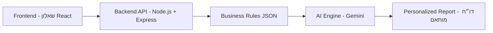

# 📘 מערכת הערכת רישוי עסקים

מערכת הערכת רישוי עסקים – תיאור הפרויקט והמטרות:  
המערכת נועדה לסייע לבעלי עסקים בישראל להבין את דרישות הרישוי הרלוונטיות עבורם.  
היא מקבלת מידע על העסק (כמו שטח, מספר מקומות ישיבה ושימוש בגז/בשר), מסננת דרישות מתוך תקנות רישוי כלליות,  
ומחזירה דו״ח מותאם אישי וברור בשפה נגישה.

---

## 🏗 ארכיטקטורה



---

## ⚙️ הוראות התקנה והרצה

### דרישות מקדימות
- Node.js (גרסה 18 ומעלה)
- npm או yarn
- API Key ל־Gemini / GPT (להכניס בקובץ `.env`)

### התקנה
```bash
git clone <repo-url>
cd business-licensing-assistant
npm install
```

### הפעלת השרת
```bash
npm start
```

שרת יעלה בכתובת:  
👉 `http://localhost:4000`

---

## 📡 תיעוד API

### 1. ניתוח עסק
**POST** `/analyze`  

קלט:
```json
{
  "business": {
    "area": 120,
    "seats": 40,
    "usesGas": true,
    "servesMeat": false
  },
  "text": "טקסט התקנות או סעיפים לבחינה"
}
```

פלט:
```json
{
  "report": "דו״ח מותאם אישית בעברית פשוטה"
}
```

---

## 🗄 מבנה הנתונים (JSON לדוגמה)

```json
{
  "requirements": {
    "fire_safety": [
      {
        "requirement": "יש להתקין מערכת גילוי אש",
        "reference": "פרק 6, סעיף 6.15.1",
        "conditions": {
          "areaMin": 50,
          "seatsMin": 50
        }
      }
    ],
    "gas_safety": [
      {
        "requirement": "מערכת הגז חייבת לעמוד בדרישות ת\"י 158",
        "reference": "פרק 6, סעיף 6.23.1",
        "conditions": {
          "usesGas": true
        }
      }
    ]
  }
}
```

---

## 🧩 אלגוריתם ההתאמה
1. קבלת תשובות המשתמש מהשאלון (שטח, מקומות ישיבה, שימוש בגז/בשר).  
2. סינון JSON לפי תנאים (`areaMin`, `seatsMin`, `usesGas`, `servesMeat`).  
3. שליחת הדרישות הרלוונטיות למנוע ה־AI.  
4. יצירת דו״ח בשפה פשוטה וברורה.  

---

## 🤖 שימוש ב-AI

### כלי פיתוח בהם נעשה שימוש
- ChatGPT (תכנון ארכיטקטורה, כתיבת קוד בסיסי)  
- Cursor / Windsurf (סיוע בכתיבת קוד)  
- GitHub Copilot (השלמות אוטומטיות)  

### מודל שפה מרכזי
- Gemini 1.5 (Google AI)  

### Prompt לדוגמה
```
יש לי רשימת סעיפים מתוך תקנות רישוי עסקים.
חלקם אינם דרישות ישירות (כמו הסברים, הגדרות או תיאורי בעלי תפקידים).
אנא החזר רק את הדרישות הישירות שחובה על בעל עסק לבצע או למלא,
בפורמט JSON עם שדות: requirement, reference, conditions.
```

---

## 📖 יומן פיתוח
- אתגר: חיבור ל־Gemini API גרם לשגיאות 429 → נפתר באמצעות האטת הבקשות ושימוש ב־retry.  
- אתגר: המרת PDF לטקסט → נפתר באמצעות ספריית `pdfplumber` והכנת JSON מובנה.  
- לקח: עדיף לעבד מראש ל־JSON ולא לשלוח טקסט לא מובנה למודל.  
- שיפור: הוספת תנאים (כמו `areaMin`, `usesGas`) מאפשרת מיפוי ישיר בין מאפייני עסק לדרישות.  

---

## 🚀 שיפורים עתידיים
- תמיכה בקטגוריות עסקים נוספות (ברים, חנויות, מפעלים).  
- חיבור למסד נתונים אמיתי (PostgreSQL).  
- תמיכה בריבוי שפות (עברית / אנגלית).  
- הוספת שדה `priority` כדי לדרג דרישות (חובה, קריטי, המלצה).  

---

## 📸 מסכים נדרשים
1. שאלון למאפייני העסק.  
2. דו״ח מותאם אישית.  
3. JSON הדרישות המעובדות.  

---

## 📦 Dependencies
- express  
- node-fetch  
- cors  
- dotenv  
- pdfplumber (לקריאת PDF)  

---

## 📝 רישוי
פרויקט זה פותח כחלק ממטלה טכנית. שימוש חופשי לצורכי לימוד והדגמה בלבד.  
