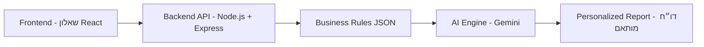

# 📘 מערכת הערכת רישוי עסקים

מערכת הערכת רישוי עסקים – תיאור הפרויקט והמטרות:  
המערכת נועדה לסייע לבעלי עסקים בישראל להבין את דרישות הרישוי הרלוונטיות עבורם.  
היא מקבלת מידע על העסק (כמו שטח, מספר מקומות ישיבה ושימוש בגז/בשר), מסננת דרישות מתוך תקנות רישוי כלליות,  
ומחזירה דו״ח מותאם אישי וברור בשפה נגישה.

---

## 🏗 ארכיטקטורה



---

## ⚙️ הוראות התקנה והרצה

### דרישות מקדימות
- Node.js
- npm
- API Key ל־ Gemini / GPT (להכניס בקובץ `.env`)- if needed, i would be happy to give you .env file, just tell me :)
- link- https://aistudio.google.com/app/apikey

### התקנה
```bash
git clone <repo-url>
cd business-licensing-assistant
npm install
```

### הפעלת השרת
```bash
npm start
```

שרת יעלה בכתובת:  
`http://localhost:4000`

---

## 📡 תיעוד API

### 1. ניתוח עסק
**POST** `/report`  

קלט:
```json
{
  "business": {
    "area": 120,
    "seats": 40,
    "usesGas": true,
    "servesMeat": false
  },
  "text": "טקסט התקנות או סעיפים לבחינה"
}
```

פלט:
```json
{
  "report": "דו״ח מותאם אישית בעברית פשוטה"
}
```

---

## 🗄 מבנה הנתונים (JSON לדוגמה)

```json
{
  "requirements": {
    "fire_safety": [
      {
        "requirement": "יש להתקין מערכת גילוי אש",
        "reference": "פרק 6, סעיף 6.15.1",
        "conditions": {
          "areaMin": 50,
          "seatsMin": 50
        }
      }
    ],
    "gas_safety": [
      {
        "requirement": "מערכת הגז חייבת לעמוד בדרישות ת\"י 158",
        "reference": "פרק 6, סעיף 6.23.1",
        "conditions": {
          "usesGas": true
        }
      }
    ]
  }
}
```

---

## 🧩 אלגוריתם ההתאמה
1. קבלת תשובות המשתמש מהשאלון (שטח, מקומות ישיבה, שימוש בגז/בשר).  
2. סינון JSON לפי תנאים (`areaMin`, `seatsMin`, `usesGas`, `servesMeat`).  
3. שליחת הדרישות הרלוונטיות למנוע ה־AI.  
4. יצירת דו״ח בשפה פשוטה וברורה.  

---
## 📝 סקריפט עיבוד נתונים – `process_file.py`

סקריפט זה אחראי על **עיבוד קבצי PDF או Word (DOCX) של תקנות רישוי עסקים** והמרתם לפורמט **JSON מובנה**.

### מה הסקריפט עושה?
1. **קריאת קובץ** – תומך ב־PDF (עם `PyPDF2`) וב־Word (עם `python-docx`).  
2. **פירוק לטקסט** – שולף את השורות/פסקאות מתוך הקובץ.  
3. **זיהוי תנאים (conditions)** – מחפש ביטויים רגולטוריים בתוך הטקסט, לדוגמה:  
   - מספר מ"ר → `areaMin`  
   - מספר מקומות ישיבה → `seatsMin`  
   - אזכור "גז"/"גפ״מ" → `usesGas`  
   - אזכור "בשר"/"עופות"/"דגים" → `servesMeat`  
   - אם אין התאמה → מסמן כ־`always: true`  
4. **זיהוי מקור (reference)** – מנסה לזהות מספר פרק/סעיף (regex ל־`סעיף` או `פרק`).  
5. **קטלוג דרישות (categories)** – משייך כל דרישה לקטגוריה:  
   - `fire_safety` (אש, כיבוי, ספרינקלרים)  
   - `gas_safety` (גז, גפ״מ)  
   - `public_health` (בשר, דגים, מזון, בריאות)  
6. **שמירה לפורמט JSON** – יוצר `requirements.json` עם מבנה מסודר:  
### איך להריץ?
```bash
python process_file.py regulations.pdf
```
או:
```bash
python process_file.py regulations.docx
```

📂 הפלט יישמר כקובץ `requirements.json` באותה תיקייה.


## 🤖 שימוש ב-AI

### כלי פיתוח בהם נעשה שימוש
- ChatGPT 5 

### מודל שפה מרכזי
- gemini-1.5-flash (Google AI)  

### Prompt לדוגמה
```
אתה יועץ רישוי עסקים.
יש לי עסק עם המאפיינים:
- גודל: x מ"ר
- מקומות ישיבה: y
- שימוש בגז: T/F
- מגיש בשר: T/F

דרישות רגולטוריות שנמצאו:
"דרישות"

אנא צור דוח מותאם אישית וברור לבעל העסק:
- חלק את המידע לקטגוריות: בטיחות אש, בטיחות גז, בריאות הציבור.
- פרט כל דרישה בשפה פשוטה (מה צריך לעשות בפועל).
- הוסף סדר עדיפויות: חובה מיד / חשוב / כדאי.
- הצג את התוצאה ברשימות נקודות, מסודר וקריא.
 אל תכלול שם עסק, תאריך .
 אם יש תקן מסויים, תכתוב מה הוא אומר, זה צריך להיות מובן למשתמש
```

---

## 📖 יומן פיתוח
- אתגר: חיבור ל־Gemini API גרם לשגיאות 429, שאומר שחרגתי ממספר הבקשות המקסימלי שניתן עבור המפתח הספציפי. הפתרון היה לפתוח ממכשיר אחר (מהטלפון) מפתח חדש ולהשתמש בו.
- הקובץ דרישות שנוצר מהpdf הנתון ענק, לכן יצרתי קובץ דמה, שכולל 8 דרישות עיקריות ועבדתי איתו - exampleRequirement.json.
- שיפור: הוספת תנאים (כמו `areaMin`, `usesGas`) מאפשרת מיפוי ישיר בין מאפייני עסק לדרישות.  

---

## 🚀 שיפורים עתידיים
- תמיכה בקטגוריות עסקים נוספות (ברים, חנויות, מפעלים).  
- חיבור למסד נתונים אמיתי (PostgreSQL).  

---

## צילומי מסך


---

## 📦 Dependencies

### Frontend
- react ^19.1.1
- react-dom ^19.1.1
- react-scripts 5.0.1
- @testing-library/react ^16.3.0
- @testing-library/dom ^10.4.1
- @testing-library/jest-dom ^6.8.0
- @testing-library/user-event ^13.5.0
- web-vitals ^2.1.4

### Backend
- express ^5.1.0
- cors ^2.8.5
- dotenv ^17.2.2
- node-fetch ^3.3.2
- @google/generative-ai ^0.24.1

---
